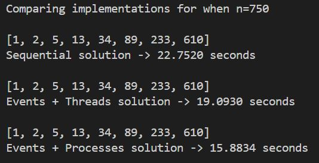

# Markoff-Fibonacci Numbers Project

---

## Skills Assessed
- Apply parallel and distributed computing to computational problems and analyze the scalability and efficiency of the solutions.
- Apply Python towards several contemporary programming requirements and techniques involving secure, distributed, and parallel computing.

## Objective
Write **2 solutions** that display all the Markoff-Fibonacci Numbers that are less than 750.

### 1. Threaded Python Script
- Create a Python script that efficiently utilizes **at least 4 Threads** and **events** to solve the problem.

### 2. Multiprocessing Python Script
- Create a Python script that efficiently utilizes **at least 4 processes** via **Multiprocessing** and **events** to solve the problem.

---

## Sample Run

Below is a screenshot of the test script comparing the different solutions:

---

## Background

### Markoff Numbers
The Markoff equation is given by:

x² + y² + z² = 3xyz (in positive integers x ≤ y ≤ z)

A **Markoff number** is any positive integer that is a component of some solution triple to the Markoff equation.  
The first few Markoff numbers are: 1, 2, 5, 13, 29, 34, 89, 169, 194, 233, 433, 610, ...

---

### Fibonacci Numbers
The **Fibonacci sequence** `{Fm}` (m ≥ 0) is defined as:

$$
F_0 = 0, \quad F_1 = 1
$$

$$
F_{m+2} = F_{m+1} + F_m \quad \text{for all } m \geq 0
$$

The first few terms are: 0, 1, 1, 2, 3, 5, 8, 13, 21, 34, 55, 89, 144, 233, 377, 610, 987, ...

---

### Markoff-Fibonacci Numbers
**Markoff-Fibonacci numbers** are numbers that appear in **both** sequences.  

The first few terms are: 1, 2, 5, 13, 34, 89, 233, 610, ...

